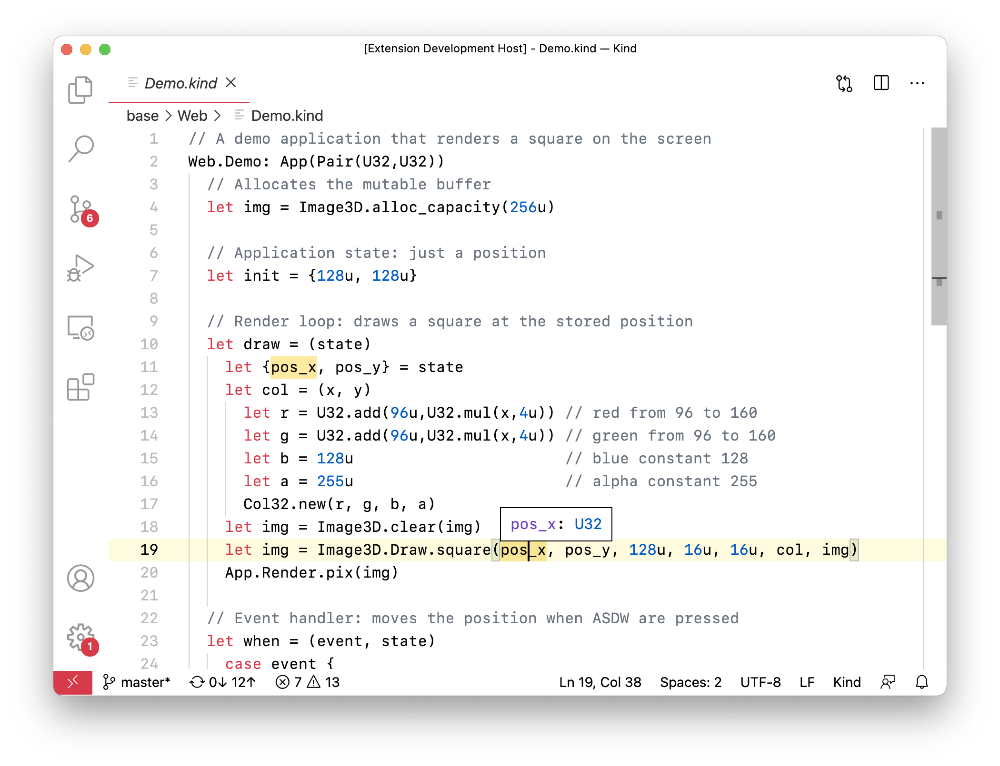

# formality-vscode

A Visual Studio Code plugin for the Formality programming language. This plugin provides output from the formality typechecker to VSCode.



## Structure

```
.
├── client // Language Client
│   ├── src
│   │   ├── test // End to End tests for Language Client / Server
│   │   └── extension.ts // Language Client entry point
├── package.json // The extension manifest.
└── server // Language Server
    └── src
        └── server.ts // Language Server entry point
```

## Getting Started

To install all of the necessary dependencies, run

```bash
npm install
```

In VSCode there is a launch configuration named "Launch Client" that will start an instance of VSCode with the plugin enabled.

## Roadmap

The following features are planned:

- [ ] Hover over a symbol to view its documentation
- [ ] Jump to definition
- [ ] Autocompletion
- [ ] Rename symbol
- [ ] Support for other editors, for example: Atom, vim
